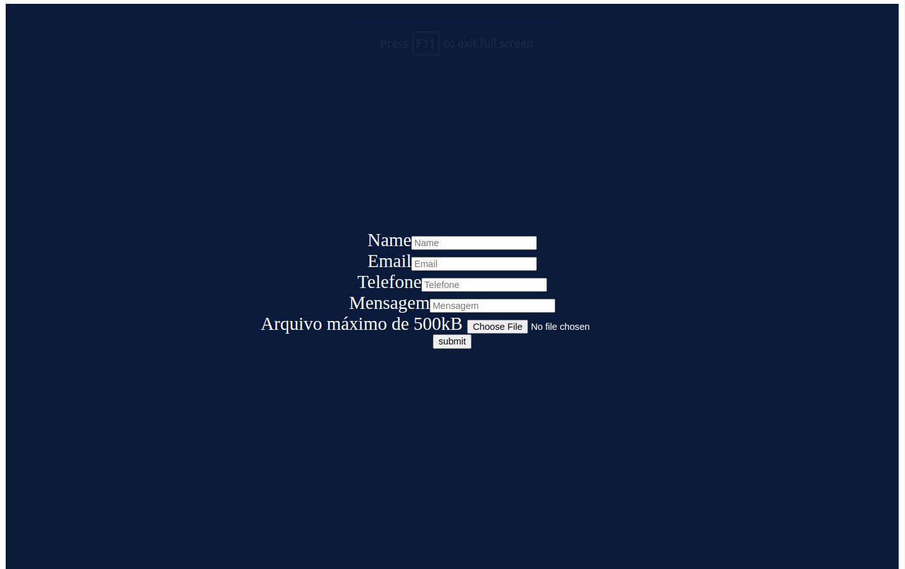

# MSB - Desafio Full-Stack

## Descrição

O desafio era criar uma aplicação full-stack, front-end com [React](https://reactjs.org) e back-end com [Node.js](https://nodejs.org) e [PostgreSQL](https://www.postgresql.org/). O desafio era receber um formulário com arquivo e enviar para o servidor/api. Na api salva os dados em uma pasta e as informações são salvas no banco de dados postgres.

## Rodando localmente

### Pré-requisitos

Ter o [Node.js](https://nodejs.org), [PostgreSQL](https://www.postgresql.org/) ou [Docker](https://www.docker.com/) instalados e configurados no seu computador.

### Comandos

```bash
# clonando o projeto
$ git clone git@github.com:martinsilver/MSB.git
```
#### Front-end
```bash
# na raiz do projeto
$ cd MSB/front-msb

# instalando dependências
$ npm install

# rodando o front-end
$ npm run build
```

#### Back-end
```bash
# na raiz do projeto
$ cd MSB/back-msb

# instalando dependências
$ npm install

# caso você tenha docker, este comando: cria um container do postgres e o inicia
$ docker run -d --name postgres-container -e TZ=UTC -p 30432:5432 -e POSTGRES_DB=db_test -e POSTGRES_PASSWORD=My:s3Cr3t/ ubuntu/postgres:14-22.04_beta
```

##### Variáveis de ambiente
No arquivo `env.exemplo` remove para `.env` e defina as variáveis de ambiente.

```bash
# popular o banco de dados 
$ npm run migration:run

# rodando o back-end
$ npm run dev
```

Agora acesse o site no navegador:
[http://localhost:3030/](http://localhost:3030/)


## Screenshot

|      |
|-----------------------------------------|
| _Página-inicial_                        |
